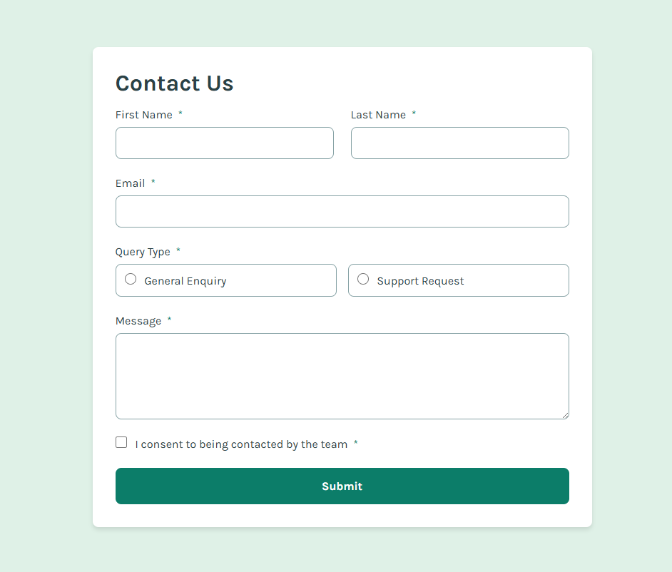
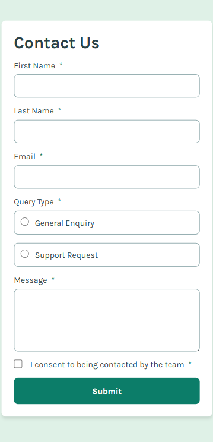

<h1 align="center"> Frontend Mentor - Solução de Formulário de Contato</h1>

Essa é uma solução para o [Desafio Formulário de Contato no Frontend Mentor](https://www.frontendmentor.io/challenges/contact-form--G-hYlqKJj). Os desafios do Frontend Mentor ajudam você a aprimorar suas habilidades de programação por meio da criação de projetos realistas.

    

## 💻 Projeto

Este projeto é um formulário de contato, onde há diversos inputs e mensagens de erro. É importante frizar que os dados no formulário <strong>**não são coletados.**</strong>

## 🚀 Tecnologias

Esse projeto foi desenvolvido com as seguintes tecnologias:

- HTML
- CSS
- JavaScript
- Git e GitHub

### O Que Aprendi

- Os vários tipos de inputs e seus atributos
- Estilização de inputs
- Criação da lógica atráves do valor dos inputs

### Links
- Acesse a URL da solução [clicando aqui](https://github.com/Antonio-Rafael-Silva/contact-form)
- Acesse o site do projeto [clicando aqui](https://antonio-rafael-silva.github.io/contact-form/)

## Screenshot do resultado

### Versão Desktop

 
    

### Versão Mobile

 
    

<!-- ## Autor -->

- Website - [Antônio Rafael](https://github.com/Antonio-Rafael-Silva/contact-form)
- Frontend Mentor - [@Antonio-Rafael-Silva](https://www.frontendmentor.io/profile/Antonio-Rafael-Silva)
- Linkedin - [Antônio Rafael](https://www.linkedin.com/in/ant%C3%B4nio-rafael-01131b372/)